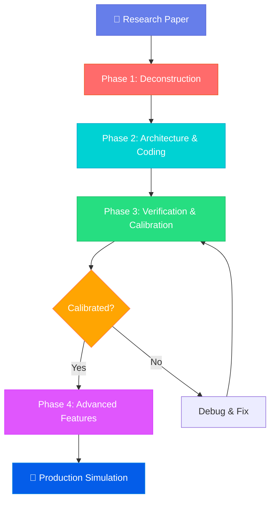

<div align="center">

<table style="border: none; margin: 0 auto; padding: 0; border-collapse: collapse;">
<tr>
<td align="center" style="vertical-align: middle; padding: 10px; border: none; width: 250px;">
  
</td>
<td align="left" style="vertical-align: middle; padding: 10px 0 10px 30px; border: none;">
  <pre style="font-family: 'Courier New', monospace; font-size: 16px; color: #0EA5E9; margin: 0; padding: 0; text-shadow: 0 0 10px #0EA5E9, 0 0 20px rgba(14,165,233,0.5); line-height: 1.2; transform: skew(-1deg, 0deg); display: block;">    ██████╗  █████╗ ██████╗ ███████╗██████╗ ██████╗ ███████╗██╗███╗   ███╗
    ██╔══██╗██╔══██╗██╔══██╗██╔════╝██╔══██╗╚════██╗██╔════╝██║████╗ ████║
    ██████╔╝███████║██████╔╝█████╗  ██████╔╝ █████╔╝███████╗██║██╔████╔██║
    ██╔═══╝ ██╔══██║██╔═══╝ ██╔══╝  ██╔══██╗██╔═══╝ ╚════██║██║██║╚██╔╝██║
    ██║     ██║  ██║██║     ███████╗██║  ██║███████╗███████║██║██║ ╚═╝ ██║
    ╚═╝     ╚═╝  ╚═╝╚═╝     ╚══════╝╚═╝  ╚═╝╚══════╝╚══════╝╚═╝╚═╝     ╚═╝</pre>
</td>
</tr>
</table>

# Paper2Sim: Hybrid OR/LLM Simulation Engine

### *Transform Game Theory Papers into High-Fidelity Agent Simulations*

<p>
  <a href="https://github.com/HKUDS/DeepCode/stargazers"></a>
  
  
</p>
<p>
  <a href="https://discord.gg/yF2MmDJyGJ"></a>
  <a href="https://github.com/HKUDS/DeepCode/issues/11"></a>
</p>

<div align="center">
  <div style="width: 100%; height: 2px; margin: 20px 0; background: linear-gradient(90deg, transparent, #00d9ff, transparent);"></div>
</div>

<div align="center">
  <a href="#-quick-start" style="text-decoration: none;">
    
  </a>
</div>

<div align="center" style="margin-top: 10px;">
  <a href="README.md">
    
  </a>
  <a href="README_ZH.md">
    
  </a>
</div>

> *"Environment as Law (Math), Agent as Brain (LLM)"*

</div>

---

## 📑 Table of Contents

- [🎯 Project Overview](#-project-overview)
- [✨ Core Philosophy](#-core-philosophy)
- [🚀 Key Features](#-key-features)
- [🏗️ Pipeline Architecture](#️-pipeline-architecture)
- [⚡ Quick Start](#-quick-start)
- [💡 Usage Examples](#-usage-examples)
- [📊 Output Structure](#-output-structure)
- [🎓 Supported Paper Types](#-supported-paper-types)
- [🔧 Configuration](#-configuration)
- [📄 License](#-license)

---

## 🎯 Project Overview

**Paper2Sim** is an automated hybrid simulation engine that converts operations research (OR) and game theory papers into executable agent-based simulations. Unlike traditional stylized mathematical models or black-box LLM simulations, Paper2Sim creates **verifiable, theoretically-grounded simulations** where:

- **Mathematical environments** enforce hard constraints (payoffs, state transitions)
- **LLM agents** exhibit cognitive behavior with bounded rationality
- **Automatic calibration** ensures agents reproduce theoretical propositions before exploring emergent behavior

### The Challenge

Traditional OR/management science research relies on highly simplified mathematical models that lack behavioral realism. Pure LLM-based social simulations, while behaviorally rich, lack verifiability and logical consistency. **Paper2Sim bridges this gap.**

### Our Solution

A multi-phase pipeline that:
1. **Extracts** game-theoretic models from papers
2. **Implements** white-box environments and gray-box LLM agents
3. **Calibrates** agents to match theoretical predictions
4. **Explores** emergent phenomena with memory, language, and adversarial testing

---

## ✨ Core Philosophy

### 🎯 Three Design Principles

#### 1. **Environment as Law (White-Box)**
- State transitions and payoffs are **deterministic Python code**
- Directly mapped from paper equations
- LLMs cannot "imagine" rewards—they can only "perceive" them

#### 2. **Rationality First (Calibration)**
- Agents must pass a "Turing test" for game understanding
- At Temperature=0, agents reproduce paper Propositions
- Advanced features (memory, emotion) only enabled after calibration

#### 3. **Cognitive Layering (Gray-Box Agents)**
- Start with pure theory (rational agents)
- Progressively add: memory → framing effects → adversarial probing
- Observe system emergence while maintaining theoretical grounding

---

## 🚀 Key Features

<table align="center" width="100%" style="border: none; table-layout: fixed;">
<tr>
<td width="33%" align="center" style="vertical-align: top; padding: 20px;">

### 🧬 **Automatic Model Extraction**

Extract game structure `<N, S, A, U>` from PDF/Markdown papers:
- Players and roles
- State variables
- Action spaces
- Utility functions

</td>
<td width="33%" align="center" style="vertical-align: top; padding: 20px;">

### 🏗️ **Architecture Generation**

Produces clean separation:
- `environment.py` (math only)
- `agents.py` (LLM-powered)
- `runner.py` (orchestration)
- `tests/` (verification suite)

</td>
<td width="33%" align="center" style="vertical-align: top; padding: 20px;">

### ✅ **Automatic Calibration**

Closed-loop debugging:
- Converts Propositions → unit tests
- Diagnoses failures (calculation, motivation, etc.)
- Auto-fixes prompts until calibrated

</td>
</tr>
<tr>
<td width="33%" align="center" style="vertical-align: top; padding: 20px;">

### 🧠 **Long-Term Memory**

ChromaDB-backed episodic memory:
- Path-dependent behavior
- Trust dynamics
- Professional burnout modeling

</td>
<td width="33%" align="center" style="vertical-align: top; padding: 20px;">

### 💬 **Strategic Communication**

Natural language layer:
- Framing effects (gain vs loss)
- Deception detection
- Rhetorical manipulation

</td>
<td width="33%" align="center" style="vertical-align: top; padding: 20px;">

### 🔴 **Red Team Testing**

Adversarial mechanism probing:
- Exploit discovery
- Goodhart's Law detection
- Robustness analysis reports

</td>
</tr>
</table>

---

## 🏗️ Pipeline Architecture

### 🌟 **Four-Phase Workflow**



### 📋 **Phase Details**

#### **Phase 1: Deconstruction**
**Agents**: The Theorist + The Critic

- **Input**: PDF/LaTeX paper
- **Output**: 
  - `game_model.json` (players, states, actions, utilities)
  - `test_verification.py` (Propositions → unit tests)

**Example JSON:**
```json
{
  "players": ["physician", "patient"],
  "state_variables": {
    "prior_belief": {"type": "float", "range": [0, 1]},
    "test_cost": {"type": "float", "range": [0, 10]}
  },
  "actions": {
    "physician": ["TEST", "NO_TEST"],
    "patient": ["ACCEPT", "REJECT"]
  },
  "utility_functions": {
    "physician": "U_doc = reputation - cost * I_test",
    "patient": "U_patient = health_gain - payment"
  }
}
```

#### **Phase 2: Architecture & Coding**
**Agents**: The Architect + The Engineer

- **Input**: `game_model.json`
- **Output**: Production-ready simulation code
  - `environment.py` — White-box (no LLM calls)
  - `agents.py` — Gray-box (LLM-powered decisions)
  - `runner.py` — Simulation orchestration
  - `config.py` — Hyperparameters

**Code Structure:**
```
simulation/
├── environment.py      # Pure math implementation
├── agents.py           # LLM agent classes
├── runner.py           # Main simulation loop
├── config.py           # Parameters & settings
├── tests/              # Unit tests from Phase 1
│   └── test_propositions.py
└── main.py             # Entry point
```

#### **Phase 3: Verification & Calibration**
**Agent**: The QA Specialist

- **Process**:
  1. Set Temperature=0
  2. Run all unit tests from Phase 1
  3. If failures detected:
     - Extract decision chain-of-thought
     - Diagnose error type (calculation, motivation, strategy, probability)
     - Apply targeted prompt fix
     - Retry
  4. Iterate until 100% test pass rate

- **Milestone**: System marked as `Calibrated` ✅

#### **Phase 4: Advanced Features (Optional)**
**Agents**: The Historian + Narrative Designer + Red Teamer

Once calibrated, enable:

1. **Memory (Historian)**
   - Vector store for episodic memory
   - Psychological states (trust, frustration, confidence)
   - Path-dependent behavior

2. **Language (Narrative Designer)**
   - Natural language communication between agents
   - Framing effects (90% survival vs 10% death)
   - Deception detection

3. **Red Teaming**
   - Evolutionary strategy search
   - Mechanism exploit discovery
   - Robustness report generation

---

## ⚡ Quick Start

### 📦 **Installation**

#### **Option 1: Using UV (Recommended)**

```bash
# Clone repository
git clone https://github.com/HKUDS/DeepCode.git
cd DeepCode/
git checkout paper2sim

# Install UV package manager
curl -LsSf https://astral.sh/uv/install.sh | sh

# Setup environment
uv venv --python=3.10
source .venv/bin/activate  # Windows: .venv\Scripts\activate
uv pip install -r requirements.txt
```

#### **Option 2: Using pip**

```bash
# Clone repository
git clone https://github.com/HKUDS/DeepCode.git
cd DeepCode/
git checkout paper2sim

# Install dependencies
pip install -r requirements.txt
```

### 🔑 **Configuration**

#### **Step 1: Configure LLM API Keys**

Edit `mcp_agent.secrets.yaml`:

```yaml
# Choose ONE of the following:

# Option A: OpenRouter (Recommended - access all models with one key)
openrouter:
  api_key: "sk-or-v1-your-key-here"

# Option B: OpenAI
openai:
  api_key: "sk-your-openai-key"
  base_url: "https://api.openai.com/v1"  # or custom endpoint

# Option C: Anthropic
anthropic:
  api_key: "sk-ant-your-key"

# Option D: Google Gemini
google:
  api_key: "your-gemini-key"
```

**🎯 Get OpenRouter Key (Recommended):**
- Visit: https://openrouter.ai/keys
- One key for all models (OpenAI, Anthropic, Google, DeepSeek, etc.)

#### **Step 2: Select LLM Provider**

Edit `mcp_agent.config.yaml` (line ~106):

```yaml
# Choose your preferred provider
llm_provider: "openrouter"  # or "openai", "anthropic", "google"

# OpenRouter model configuration (if using OpenRouter)
openrouter:
  base_url: "https://openrouter.ai/api/v1"
  default_model: "anthropic/claude-sonnet-4"           # Reasoning
  planning_model: "anthropic/claude-sonnet-4"          # Extraction & planning
  implementation_model: "google/gemini-2.0-flash-exp"  # Code generation
```

**💡 Recommended Model Combinations:**

| Use Case | Planning Model | Implementation Model |
|----------|---------------|----------------------|
| **Best Quality** | `anthropic/claude-opus-4` | `anthropic/claude-sonnet-4` |
| **Balanced** ⭐ | `anthropic/claude-sonnet-4` | `google/gemini-2.0-flash-exp` |
| **Budget** | `google/gemini-2.5-flash` | `google/gemini-2.0-flash-exp` |

#### **Step 3 (Optional): Web Search API**

For paper reference analysis, configure search (line ~28 or ~74):

```yaml
# Option A: Brave Search
brave:
  env:
    BRAVE_API_KEY: "your_brave_key"

# Option B: Bocha-MCP
bocha-mcp:
  env:
    BOCHA_API_KEY: "your_bocha_key"
```

### 🚀 **Run Paper2Sim**

#### **Supported Formats**

Paper2Sim supports two input formats:
- **Markdown (`.md`)**: For plain text papers or pre-converted documents
- **PDF (`.pdf`)**: ⭐ **Recommended for math-heavy OR/OM/MS papers**
  - Directly processed by PDF-capable models (e.g., Gemini)
  - Preserves mathematical notation, formulas, and Greek letters
  - No manual text conversion needed

```bash
# Using Markdown file
python -m paper2sim.main --paper path/to/paper.md

# Using PDF file (recommended for mathematical papers)
python -m paper2sim.main --paper path/to/paper.pdf

# Specify output directory
python -m paper2sim.main --paper paper.pdf --output ./simulations --name my_sim

# Enable Phase 4 features (after calibration!)
python -m paper2sim.main --paper paper.pdf --phase4
```

> 💡 **PDF Support**: When using PDF input, the system automatically uses PDF-capable models (like `google/gemini-2.0-flash-exp`) to directly process the file, ensuring accurate extraction of mathematical formulas. See [PDF Support Documentation](paper2sim/PDF_SUPPORT.md)

### 📝 **Programmatic Usage**

```python
from paper2sim.workflows.paper2sim_workflow import Paper2SimWorkflow
from utils.llm_utils import get_preferred_llm_class

# Initialize workflow
workflow = Paper2SimWorkflow(
    llm_factory=get_preferred_llm_class(),
    output_base_dir="./paper2sim_output"
)

# Run pipeline (supports .md or .pdf files)
results = await workflow.run_full_pipeline(
    paper_path="papers/physician_testing.pdf",  # or .md file
    project_name="physician_sim",
    enable_phase4=False  # Start with calibration only
)

# Check calibration status
if results['is_calibrated']:
    print("✅ Simulation is calibrated and ready!")
    print(f"📁 Output: {results['output_dir']}")
```

---

## 💡 Usage Examples

### Example 1: Physician Testing Game

**Paper**: "Physician Testing in Signaling Equilibria"

```bash
python -m paper2sim.main --paper papers/physician_testing.pdf
```

**Generated Output:**
```
paper2sim_output/physician_testing/
├── game_model.json              # Extracted: 2 players, 4 states, 2 actions
├── architecture.json             # Design: Bayesian signaling game
├── test_verification.py          # 5 propositions → unit tests
├── calibration_report.json       # ✅ 100% test pass (3 iterations)
└── simulation/
    ├── environment.py            # Bayesian update logic
    ├── agents.py                 # PhysicianAgent, PatientAgent
    ├── runner.py                 # 1000-round simulation
    └── main.py                   # python main.py to run
```

**Calibration Report:**
```json
{
  "status": "calibrated",
  "iterations": 3,
  "test_results": {
    "test_prop1_cost_threshold": "PASS",
    "test_prop2_separating_eq": "PASS",
    "test_prop3_pooling_condition": "PASS",
    "test_lemma1_belief_update": "PASS",
    "test_prop4_welfare": "PASS"
  },
  "fixes_applied": [
    "Added Python calculator tool for expected value computation",
    "Clarified long-term reputation importance in system prompt"
  ]
}
```

### Example 2: Screening Game with Phase 4

```bash
python -m paper2sim.main --paper papers/insurance_screening.md --phase4
```

**Phase 4 Features Enabled:**
- **Memory**: Insurers remember past claims, adjust premiums based on trust
- **Language**: Customers use framing ("peace of mind" vs "unlikely to claim")
- **Red Team**: Discovers premium discrimination exploit

---

## 📊 Output Structure

```
paper2sim_output/
└── {project_name}/
    ├── game_model.json              # Phase 1: Extracted game structure
    │   ├── players                   # [str] Player roles
    │   ├── state_variables           # {name: {type, range, description}}
    │   ├── actions                   # {player: [actions]}
    │   ├── utility_functions         # {player: formula}
    │   └── propositions              # [{statement, conditions}]
    │
    ├── architecture.json             # Phase 2: System design spec
    │   ├── file_structure            # Planned directory tree
    │   ├── environment_design        # White-box implementation notes
    │   ├── agent_design              # Gray-box agent architecture
    │   └── dependencies              # Required libraries
    │
    ├── test_verification.py          # Phase 1: Generated unit tests
    │   └── def test_prop{N}(): ...   # One test per proposition
    │
    ├── calibration_report.json       # Phase 3: QA results
    │   ├── status                    # "calibrated" | "failed"
    │   ├── iterations                # Number of debug cycles
    │   ├── test_results              # {test_name: PASS/FAIL}
    │   └── fixes_applied             # [str] Prompt modifications
    │
    └── simulation/                   # Phase 2: Generated code
        ├── environment.py            # ✅ White-box (no LLM)
        ├── agents.py                 # ✅ Gray-box (LLM-powered)
        ├── runner.py                 # Simulation orchestration
        ├── config.py                 # Hyperparameters
        ├── main.py                   # Entry point
        ├── requirements.txt          # Python dependencies
        ├── README.md                 # Usage instructions
        └── tests/
            └── test_propositions.py  # Copy of verification tests
```

---

## 🎓 Supported Paper Types

Paper2Sim works best with papers containing:

### ✅ **Ideal Paper Types**
- **Signaling games** (e.g., education signaling, physician testing)
- **Screening games** (e.g., insurance markets, credit scoring)
- **Mechanism design** (e.g., auctions, matching markets)
- **Repeated games** (e.g., trust games, cooperation)
- **Bayesian games** (information asymmetry, beliefs)

### 📋 **Required Paper Elements**
- ✅ Clearly defined players
- ✅ State variables and action spaces
- ✅ Utility/payoff functions (equations)
- ✅ At least one Proposition/Lemma/Theorem
- ✅ Mathematical model description

### ⚠️ **Not Yet Supported**
- ❌ Dynamic programming (infinite horizon)
- ❌ Continuous-time models
- ❌ Papers without explicit game structure
- ❌ Purely empirical papers (no theory)

---

## 🔧 Configuration

### Advanced Settings

Edit `mcp_agent.config.yaml` for fine-tuning:

#### **Document Segmentation**
```yaml
document_segmentation:
  enabled: true                   # Auto-split large papers
  size_threshold_chars: 50000     # Trigger threshold
```

#### **Simulation Parameters**
```yaml
paper2sim:
  max_calibration_iterations: 10  # Max debug cycles
  test_temperature: 0.0            # Calibration temperature
  exploration_temperature: 0.7     # Phase 4 temperature
  
  phase4:
    enable_memory: true            # ChromaDB integration
    enable_language: true          # NL communication
    enable_red_teaming: true       # Adversarial testing
```

#### **Model Selection Per Phase**
```yaml
openrouter:
  # Phase 1-3: High reasoning capability
  planning_model: "anthropic/claude-sonnet-4"
  
  # Phase 2: Code generation
  implementation_model: "google/gemini-2.0-flash-exp"
  
  # Phase 4: High concurrency, human-like randomness
  simulation_model: "google/gemini-2.0-flash-exp"
```

---

## 🤝 Contributing

Paper2Sim is part of the **DeepCode** project:
- **Main branch**: General research-to-code automation
- **paper2sim branch**: Specialized for OR/game theory

To contribute:
1. Fork the repository
2. Create feature branch from `paper2sim`
3. Submit PR with description

---

## 📚 Documentation

Detailed technical specifications:
- Phase 1: `paper2sim/prompts/phase1_prompts.py`
- Phase 2: `paper2sim/prompts/phase2_prompts.py`
- Phase 3: `paper2sim/prompts/phase3_prompts.py`
- Phase 4: `paper2sim/prompts/phase4_prompts.py`

---

## 🆘 Troubleshooting

### Common Issues

**Issue: "No API keys configured"**
```bash
# Check secrets file
cat mcp_agent.secrets.yaml | grep api_key

# Or set environment variable
export OPENROUTER_API_KEY="sk-or-v1-..."
```

**Issue: "Calibration failed after max iterations"**
- Review `calibration_report.json` for diagnosed issues
- Paper may lack clear mathematical formulation
- Try adjusting `test_temperature` in config

**Issue: "Model extraction incomplete"**
- Ensure paper has explicit game structure
- Check if paper is too large (enable segmentation)
- Try using higher-capability planning model

---

## 📄 License

<div align="center">


**MIT License** - Copyright (c) 2025 Data Intelligence Lab, The University of Hong Kong

Built on the **DeepCode** framework | **Branch: paper2sim**

---

<p>
  <a href="#-quick-start"></a>
  <a href="https://github.com/HKUDS/DeepCode"></a>
  <a href="https://discord.gg/yF2MmDJyGJ"></a>
</p>


</div>
