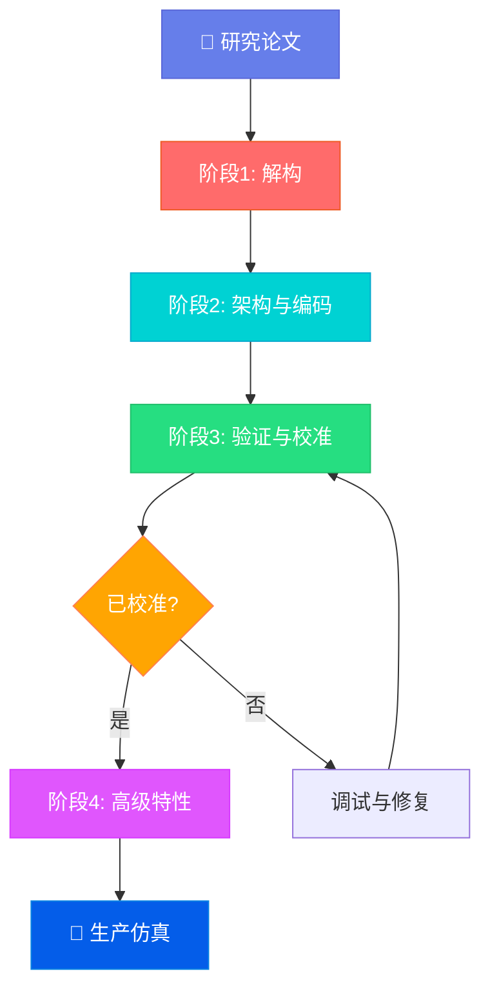

<div align="center">

<table style="border: none; margin: 0 auto; padding: 0; border-collapse: collapse;">
<tr>
<td align="center" style="vertical-align: middle; padding: 10px; border: none; width: 250px;">
  
</td>
<td align="left" style="vertical-align: middle; padding: 10px 0 10px 30px; border: none;">
  <pre style="font-family: 'Courier New', monospace; font-size: 16px; color: #0EA5E9; margin: 0; padding: 0; text-shadow: 0 0 10px #0EA5E9, 0 0 20px rgba(14,165,233,0.5); line-height: 1.2; transform: skew(-1deg, 0deg); display: block;">    ██████╗  █████╗ ██████╗ ███████╗██████╗ ██████╗ ███████╗██╗███╗   ███╗
    ██╔══██╗██╔══██╗██╔══██╗██╔════╝██╔══██╗╚════██╗██╔════╝██║████╗ ████║
    ██████╔╝███████║██████╔╝█████╗  ██████╔╝ █████╔╝███████╗██║██╔████╔██║
    ██╔═══╝ ██╔══██║██╔═══╝ ██╔══╝  ██╔══██╗██╔═══╝ ╚════██║██║██║╚██╔╝██║
    ██║     ██║  ██║██║     ███████╗██║  ██║███████╗███████║██║██║ ╚═╝ ██║
    ╚═╝     ╚═╝  ╚═╝╚═╝     ╚══════╝╚═╝  ╚═╝╚══════╝╚══════╝╚═╝╚═╝     ╚═╝</pre>
</td>
</tr>
</table>

# Paper2Sim: 混合运筹学/LLM仿真引擎

### *将博弈论论文转化为高保真智能体仿真*

<p>
  <a href="https://github.com/HKUDS/DeepCode/stargazers"></a>
  
  
</p>
<p>
  <a href="https://discord.gg/yF2MmDJyGJ"></a>
  <a href="https://github.com/HKUDS/DeepCode/issues/11"></a>
</p>

<div align="center">
  <div style="width: 100%; height: 2px; margin: 20px 0; background: linear-gradient(90deg, transparent, #00d9ff, transparent);"></div>
</div>

<div align="center">
  <a href="#-快速开始" style="text-decoration: none;">
    
  </a>
</div>

<div align="center" style="margin-top: 10px;">
  <a href="README.md">
    
  </a>
  <a href="README_ZH.md">
    
  </a>
</div>

> *"环境即法则（数学），智能体即大脑（LLM）"*

</div>

---

## 📑 目录

- [🎯 项目概述](#-项目概述)
- [✨ 核心理念](#-核心理念)
- [🚀 核心特性](#-核心特性)
- [🏗️ 流水线架构](#️-流水线架构)
- [⚡ 快速开始](#-快速开始)
- [💡 使用示例](#-使用示例)
- [📊 输出结构](#-输出结构)
- [🎓 支持的论文类型](#-支持的论文类型)
- [🔧 配置说明](#-配置说明)
- [📄 许可证](#-许可证)

---

## 🎯 项目概述

**Paper2Sim** 是一个自动化混合仿真引擎，可将运筹学(OR)和博弈论论文转换为可执行的智能体仿真系统。不同于传统的简化数学模型或黑盒LLM仿真，Paper2Sim创建**可验证、理论基础扎实的仿真**，其中:

- **数学环境**强制执行硬约束（收益、状态转移）
- **LLM智能体**表现出有限理性的认知行为
- **自动校准**确保智能体在探索涌现行为之前能够复现理论命题

### 面临的挑战

传统的运筹学/管理科学研究依赖高度简化的数学模型，缺乏行为真实性。纯粹基于LLM的社会仿真虽然行为丰富，但缺乏可验证性和逻辑一致性。**Paper2Sim弥合了这一差距。**

### 我们的解决方案

一个多阶段流水线：
1. **提取**论文中的博弈论模型
2. **实现**白盒环境和灰盒LLM智能体
3. **校准**智能体以匹配理论预测
4. **探索**涌现现象（记忆、语言、对抗测试）

---

## ✨ 核心理念

### 🎯 三大设计原则

#### 1. **环境即法则（白盒）**
- 状态转移和收益是**确定性Python代码**
- 直接映射论文公式
- LLM不能"想象"奖励——只能"感知"奖励

#### 2. **理性优先（校准）**
- 智能体必须通过博弈理解的"图灵测试"
- 在Temperature=0时，智能体复现论文命题
- 高级特性（记忆、情感）仅在校准后启用

#### 3. **认知分层（灰盒智能体）**
- 从纯理论开始（理性智能体）
- 逐步添加：记忆 → 框架效应 → 对抗探测
- 在保持理论基础的同时观察系统涌现

---

## 🚀 核心特性

<table align="center" width="100%" style="border: none; table-layout: fixed;">
<tr>
<td width="33%" align="center" style="vertical-align: top; padding: 20px;">

### 🧬 **自动模型提取**

从PDF/Markdown论文中提取博弈结构`<N, S, A, U>`:
- 参与者和角色
- 状态变量
- 动作空间
- 效用函数

</td>
<td width="33%" align="center" style="vertical-align: top; padding: 20px;">

### 🏗️ **架构生成**

生成清晰分离的结构:
- `environment.py` (仅数学)
- `agents.py` (LLM驱动)
- `runner.py` (协调)
- `tests/` (验证套件)

</td>
<td width="33%" align="center" style="vertical-align: top; padding: 20px;">

### ✅ **自动校准**

闭环调试:
- 将命题转换为单元测试
- 诊断失败（计算、动机等）
- 自动修复提示词直至校准

</td>
</tr>
<tr>
<td width="33%" align="center" style="vertical-align: top; padding: 20px;">

### 🧠 **长期记忆**

基于ChromaDB的情景记忆:
- 路径依赖行为
- 信任动态
- 职业倦怠建模

</td>
<td width="33%" align="center" style="vertical-align: top; padding: 20px;">

### 💬 **策略沟通**

自然语言层:
- 框架效应（收益vs损失）
- 欺骗检测
- 修辞操纵

</td>
<td width="33%" align="center" style="vertical-align: top; padding: 20px;">

### 🔴 **红队测试**

对抗性机制探测:
- 漏洞发现
- 古德哈特定律检测
- 鲁棒性分析报告

</td>
</tr>
</table>

---

## 🏗️ 流水线架构

### 🌟 **四阶段工作流**



### 📋 **阶段详情**

#### **阶段1: 解构**
**智能体**: 理论学家(Theorist) + 评论家(Critic)

- **输入**: PDF/LaTeX论文
- **输出**: 
  - `game_model.json` (参与者、状态、动作、效用)
  - `test_verification.py` (命题 → 单元测试)

**JSON示例:**
```json
{
  "players": ["医生", "患者"],
  "state_variables": {
    "prior_belief": {"type": "float", "range": [0, 1]},
    "test_cost": {"type": "float", "range": [0, 10]}
  },
  "actions": {
    "医生": ["检测", "不检测"],
    "患者": ["接受", "拒绝"]
  },
  "utility_functions": {
    "医生": "U_doc = 声誉 - 成本 * I_检测",
    "患者": "U_patient = 健康收益 - 费用"
  }
}
```

#### **阶段2: 架构与编码**
**智能体**: 架构师(Architect) + 工程师(Engineer)

- **输入**: `game_model.json`
- **输出**: 生产就绪的仿真代码
  - `environment.py` — 白盒（无LLM调用）
  - `agents.py` — 灰盒（LLM驱动决策）
  - `runner.py` — 仿真协调
  - `config.py` — 超参数

**代码结构:**
```
simulation/
├── environment.py      # 纯数学实现
├── agents.py           # LLM智能体类
├── runner.py           # 主仿真循环
├── config.py           # 参数与设置
├── tests/              # 阶段1的单元测试
│   └── test_propositions.py
└── main.py             # 入口点
```

#### **阶段3: 验证与校准**
**智能体**: QA专家(QA Specialist)

- **流程**:
  1. 设置Temperature=0
  2. 运行阶段1的所有单元测试
  3. 如果检测到失败:
     - 提取决策思维链
     - 诊断错误类型（计算、动机、策略、概率）
     - 应用针对性提示词修复
     - 重试
  4. 迭代直到100%测试通过率

- **里程碑**: 系统标记为`已校准` ✅

#### **阶段4: 高级特性（可选）**
**智能体**: 历史学家(Historian) + 叙事设计师(Narrative Designer) + 红队(Red Teamer)

校准后，启用:

1. **记忆（历史学家）**
   - 情景记忆的向量存储
   - 心理状态（信任、挫折、信心）
   - 路径依赖行为

2. **语言（叙事设计师）**
   - 智能体间自然语言沟通
   - 框架效应（90%存活 vs 10%死亡）
   - 欺骗检测

3. **红队测试**
   - 进化策略搜索
   - 机制漏洞发现
   - 鲁棒性报告生成

---

## ⚡ 快速开始

### 📦 **安装**

#### **方式1: 使用UV（推荐）**

```bash
# 克隆仓库
git clone https://github.com/HKUDS/DeepCode.git
cd DeepCode/
git checkout paper2sim

# 安装UV包管理器
curl -LsSf https://astral.sh/uv/install.sh | sh

# 设置环境
uv venv --python=3.10
source .venv/bin/activate  # Windows: .venv\Scripts\activate
uv pip install -r requirements.txt
```

#### **方式2: 使用pip**

```bash
# 克隆仓库
git clone https://github.com/HKUDS/DeepCode.git
cd DeepCode/
git checkout paper2sim

# 安装依赖
pip install -r requirements.txt
```

### 🔑 **配置**

#### **步骤1: 配置LLM API密钥**

编辑 `mcp_agent.secrets.yaml`:

```yaml
# 选择以下任一选项:

# 选项A: OpenRouter（推荐 - 一个密钥访问所有模型）
openrouter:
  api_key: "sk-or-v1-你的密钥"

# 选项B: OpenAI
openai:
  api_key: "sk-你的openai密钥"
  base_url: "https://api.openai.com/v1"  # 或自定义端点

# 选项C: Anthropic
anthropic:
  api_key: "sk-ant-你的密钥"

# 选项D: Google Gemini
google:
  api_key: "你的gemini密钥"
```

**🎯 获取OpenRouter密钥（推荐）:**
- 访问: https://openrouter.ai/keys
- 一个密钥访问所有模型（OpenAI、Anthropic、Google、DeepSeek等）

#### **步骤2: 选择LLM提供商**

编辑 `mcp_agent.config.yaml` (第~106行):

```yaml
# 选择您偏好的提供商
llm_provider: "openrouter"  # 或 "openai", "anthropic", "google"

# OpenRouter模型配置（如果使用OpenRouter）
openrouter:
  base_url: "https://openrouter.ai/api/v1"
  default_model: "anthropic/claude-sonnet-4"           # 推理
  planning_model: "anthropic/claude-sonnet-4"          # 提取与规划
  implementation_model: "google/gemini-2.0-flash-exp"  # 代码生成
```

**💡 推荐的模型组合:**

| 使用场景 | 规划模型 | 实现模型 |
|----------|---------|---------|
| **最佳质量** | `anthropic/claude-opus-4` | `anthropic/claude-sonnet-4` |
| **平衡方案** ⭐ | `anthropic/claude-sonnet-4` | `google/gemini-2.0-flash-exp` |
| **预算优先** | `google/gemini-2.5-flash` | `google/gemini-2.0-flash-exp` |

#### **步骤3（可选）: Web搜索API**

用于论文参考分析，配置搜索（第~28或~74行）:

```yaml
# 选项A: Brave搜索
brave:
  env:
    BRAVE_API_KEY: "你的brave密钥"

# 选项B: Bocha-MCP
bocha-mcp:
  env:
    BOCHA_API_KEY: "你的bocha密钥"
```

### 🚀 **运行Paper2Sim**

```bash
# 基本使用
python -m paper2sim.main --paper path/to/paper.md

# 指定输出目录
python -m paper2sim.main --paper paper.md --output ./simulations --name physician_sim

# 启用阶段4特性（校准后！）
python -m paper2sim.main --paper paper.md --phase4
```

### 📝 **编程方式使用**

```python
from paper2sim.workflows.paper2sim_workflow import Paper2SimWorkflow
from utils.llm_utils import get_preferred_llm_class

# 初始化工作流
workflow = Paper2SimWorkflow(
    llm_factory=get_preferred_llm_class(),
    output_base_dir="./paper2sim_output"
)

# 运行流水线
results = await workflow.run_full_pipeline(
    paper_path="papers/physician_testing.md",
    project_name="physician_sim",
    enable_phase4=False  # 从校准开始
)

# 检查校准状态
if results['is_calibrated']:
    print("✅ 仿真已校准并准备就绪!")
    print(f"📁 输出: {results['output_dir']}")
```

---

## 💡 使用示例

### 示例1: 医生检测博弈

**论文**: "信号均衡中的医生检测"

```bash
python -m paper2sim.main --paper papers/physician_testing.pdf
```

**生成输出:**
```
paper2sim_output/physician_testing/
├── game_model.json              # 提取: 2参与者, 4状态, 2动作
├── architecture.json             # 设计: 贝叶斯信号博弈
├── test_verification.py          # 5个命题 → 单元测试
├── calibration_report.json       # ✅ 100%测试通过（3次迭代）
└── simulation/
    ├── environment.py            # 贝叶斯更新逻辑
    ├── agents.py                 # 医生智能体，患者智能体
    ├── runner.py                 # 1000轮仿真
    └── main.py                   # python main.py运行
```

**校准报告:**
```json
{
  "status": "calibrated",
  "iterations": 3,
  "test_results": {
    "test_prop1_cost_threshold": "通过",
    "test_prop2_separating_eq": "通过",
    "test_prop3_pooling_condition": "通过",
    "test_lemma1_belief_update": "通过",
    "test_prop4_welfare": "通过"
  },
  "fixes_applied": [
    "添加Python计算器工具用于期望值计算",
    "在系统提示中明确长期声誉的重要性"
  ]
}
```

### 示例2: 带阶段4的筛选博弈

```bash
python -m paper2sim.main --paper papers/insurance_screening.md --phase4
```

**启用的阶段4特性:**
- **记忆**: 保险公司记住过去的索赔，基于信任调整保费
- **语言**: 客户使用框架（"安心"vs"不太可能索赔"）
- **红队**: 发现保费歧视漏洞

---

## 📊 输出结构

```
paper2sim_output/
└── {项目名称}/
    ├── game_model.json              # 阶段1: 提取的博弈结构
    │   ├── players                   # [str] 参与者角色
    │   ├── state_variables           # {名称: {类型, 范围, 描述}}
    │   ├── actions                   # {参与者: [动作]}
    │   ├── utility_functions         # {参与者: 公式}
    │   └── propositions              # [{陈述, 条件}]
    │
    ├── architecture.json             # 阶段2: 系统设计规范
    │   ├── file_structure            # 计划的目录树
    │   ├── environment_design        # 白盒实现说明
    │   ├── agent_design              # 灰盒智能体架构
    │   └── dependencies              # 所需库
    │
    ├── test_verification.py          # 阶段1: 生成的单元测试
    │   └── def test_prop{N}(): ...   # 每个命题一个测试
    │
    ├── calibration_report.json       # 阶段3: QA结果
    │   ├── status                    # "calibrated" | "failed"
    │   ├── iterations                # 调试周期数
    │   ├── test_results              # {测试名: 通过/失败}
    │   └── fixes_applied             # [str] 提示词修改
    │
    └── simulation/                   # 阶段2: 生成的代码
        ├── environment.py            # ✅ 白盒（无LLM）
        ├── agents.py                 # ✅ 灰盒（LLM驱动）
        ├── runner.py                 # 仿真协调
        ├── config.py                 # 超参数
        ├── main.py                   # 入口点
        ├── requirements.txt          # Python依赖
        ├── README.md                 # 使用说明
        └── tests/
            └── test_propositions.py  # 验证测试副本
```

---

## 🎓 支持的论文类型

Paper2Sim最适合包含以下内容的论文:

### ✅ **理想的论文类型**
- **信号博弈** (例如：教育信号、医生检测)
- **筛选博弈** (例如：保险市场、信用评分)
- **机制设计** (例如：拍卖、匹配市场)
- **重复博弈** (例如：信任博弈、合作)
- **贝叶斯博弈** (信息不对称、信念)

### 📋 **所需的论文要素**
- ✅ 明确定义的参与者
- ✅ 状态变量和动作空间
- ✅ 效用/收益函数（方程）
- ✅ 至少一个命题/引理/定理
- ✅ 数学模型描述

### ⚠️ **暂不支持**
- ❌ 动态规划（无限时域）
- ❌ 连续时间模型
- ❌ 没有明确博弈结构的论文
- ❌ 纯实证论文（无理论）

---

## 🔧 配置说明

### 高级设置

编辑 `mcp_agent.config.yaml` 进行微调:

#### **文档分割**
```yaml
document_segmentation:
  enabled: true                   # 自动分割大型论文
  size_threshold_chars: 50000     # 触发阈值
```

#### **仿真参数**
```yaml
paper2sim:
  max_calibration_iterations: 10  # 最大调试周期
  test_temperature: 0.0            # 校准温度
  exploration_temperature: 0.7     # 阶段4温度
  
  phase4:
    enable_memory: true            # ChromaDB集成
    enable_language: true          # 自然语言沟通
    enable_red_teaming: true       # 对抗测试
```

#### **各阶段模型选择**
```yaml
openrouter:
  # 阶段1-3: 高推理能力
  planning_model: "anthropic/claude-sonnet-4"
  
  # 阶段2: 代码生成
  implementation_model: "google/gemini-2.0-flash-exp"
  
  # 阶段4: 高并发，类人随机性
  simulation_model: "google/gemini-2.0-flash-exp"
```

---

## 🤝 贡献

Paper2Sim是**DeepCode**项目的一部分:
- **主分支**: 通用研究到代码自动化
- **paper2sim分支**: 专注于运筹学/博弈论

如需贡献:
1. Fork仓库
2. 从`paper2sim`创建特性分支
3. 提交带描述的PR

---

## 📚 文档

详细技术规范:
- 阶段1: `paper2sim/prompts/phase1_prompts.py`
- 阶段2: `paper2sim/prompts/phase2_prompts.py`
- 阶段3: `paper2sim/prompts/phase3_prompts.py`
- 阶段4: `paper2sim/prompts/phase4_prompts.py`

---

## 🆘 故障排除

### 常见问题

**问题: "未配置API密钥"**
```bash
# 检查secrets文件
cat mcp_agent.secrets.yaml | grep api_key

# 或设置环境变量
export OPENROUTER_API_KEY="sk-or-v1-..."
```

**问题: "达到最大迭代次数后校准失败"**
- 查看`calibration_report.json`了解诊断问题
- 论文可能缺乏清晰的数学表述
- 尝试调整配置中的`test_temperature`

**问题: "模型提取不完整"**
- 确保论文有明确的博弈结构
- 检查论文是否过大（启用分割）
- 尝试使用更高能力的规划模型

---

## 📄 许可证

<div align="center">


**MIT许可证** - 版权所有 (c) 2025 香港大学数据智能实验室

基于**DeepCode**框架构建 | **分支: paper2sim**

---

<p>
  <a href="#-快速开始"></a>
  <a href="https://github.com/HKUDS/DeepCode"></a>
  <a href="https://discord.gg/yF2MmDJyGJ"></a>
</p>


</div>
